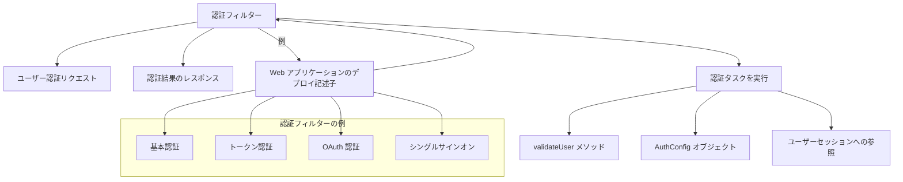

```mermaid
graph TD;
    A[認証フィルター] --> B[ユーザー認証リクエスト]
    A --> C[認証結果のレスポンス]
    A --> D[認証タスクを実行]
    
    D --> E[validateUser メソッド]
    D --> F[AuthConfig オブジェクト]
    D --> G[ユーザーセッションへの参照]
    
    H[Web アプリケーションのデプロイ記述子] --> A
    
    subgraph 認証フィルターの例
        I[基本認証]
        J[トークン認証]
        K[OAuth 認証]
        L[シングルサインオン]
    end
    
    A -->|例| H
    H --> I
    H --> J
    H --> K
    H --> L
```